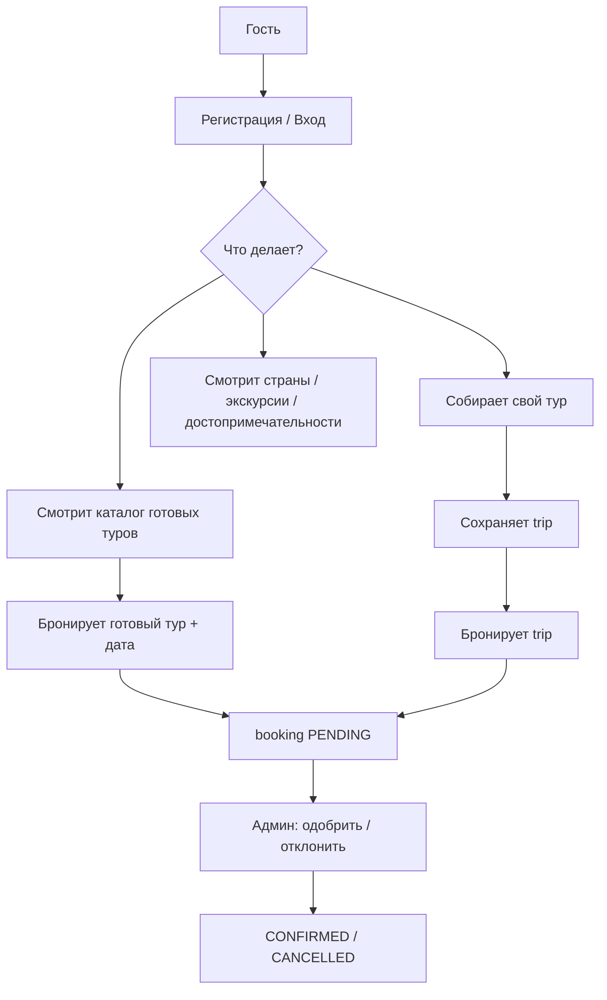

# TravelCanvas (bogdanovich)

Веб-приложение для туристического агентства: каталог стран и готовых туров, конструктор собственного маршрута, бронирование и личный кабинет. Проект учебный/демонстрационный (курсовая работа).

**Автор:** Bogdanovich Darya

---

## Содержание

1. [Технологии](#технологии)
2. [Запуск](#запуск)
3. [Адреса и URL](#адреса-и-url)
4. [Архитектура](#архитектура)
5. [Как работает приложение](#как-работает-приложение)
6. [База данных](#база-данных)
7. [REST API](#rest-api)
8. [Страницы сайта](#страницы-сайта)
9. [Безопасность](#безопасность)
10. [Расчёт цены](#расчёт-цены)
11. [Загрузка изображений](#загрузка-изображений)
12. [Структура проекта](#структура-проекта)
13. [Конфигурация](#конфигурация)

---

## Технологии

| Слой | Технология |
|------|------------|
| Backend | Java 25, **Spring Boot 4**, Spring Web, Spring Data JPA, Spring Security |
| БД | **MySQL 8** (`bogdanovich_database`) |
| Аутентификация | **JWT** (jjwt), BCrypt для паролей |
| Frontend | HTML + **Bootstrap 5** + **jQuery**, без отдельного SPA-фреймворка |
| Сборка | Maven |

Hibernate **не меняет схему БД** при старте (`ddl-auto=none`). Таблицы и данные вы управляете в MySQL самостоятельно (дамп, phpMyAdmin, Workbench).

---

## Запуск

### Требования

- JDK 25 (или версия из `pom.xml`)
- MySQL 8 с базой `bogdanovich_database`
- Maven

### Настройка БД

В `src/main/resources/application.properties` укажите подключение:

```properties
spring.datasource.url=jdbc:mysql://MySQL-8.2:3306/bogdanovich_database?...
spring.datasource.username=root
spring.datasource.password=
```

Импортируйте свой SQL-дамп в `bogdanovich_database`. Автозаполнение при старте **отключено** (классы `DemoDataLoader` и `CatalogDataLoader` удалены).

### Запуск приложения

```bash
mvn spring-boot:run
```

Или запуск главного класса `com.tours.bogdanovich.BogdanovichApplication` из IDE.

### Проверка

- Сайт: http://localhost:8087/api/site/main.html  
- API: http://localhost:8087/api/countries  
- Редирект с корня: `/` → `/api/site/main.html`

---

## Адреса и URL

У приложения задан **context-path** `/api`. Все пути ниже уже с учётом него.

| Назначение | URL |
|------------|-----|
| Главная страница | `/api/site/main.html` |
| Статика (CSS, JS) | `/api/assets/...` |
| Загруженные фото туров | `/api/uploads/tours/...` |
| REST API | `/api/countries`, `/api/tours`, … |

В браузере `config.js` задаёт:

- `API_BASE` = `http://localhost:8087/api`
- `SITE_BASE` = `http://localhost:8087/api/site/`

Токен JWT хранится в `localStorage` под ключом `token` и передаётся в заголовке `Authorization: Bearer ...`.

---

## Архитектура

```
┌─────────────────────────────────────────────────────────────┐
│  Браузер (HTML в templates/, JS в static/js/)               │
└───────────────────────────┬─────────────────────────────────┘
                            │ HTTP + JSON (+ JWT)
┌───────────────────────────▼─────────────────────────────────┐
│  Controllers  — REST-эндпоинты, приём DTO                   │
│  Security     — JwtAuthFilter, роли USER / ADMIN            │
└───────────────────────────┬─────────────────────────────────┘
                            │
┌───────────────────────────▼─────────────────────────────────┐
│  Services     — бизнес-логика (бронь, туры, цены, профиль)  │
└───────────────────────────┬─────────────────────────────────┘
                            │
┌───────────────────────────▼─────────────────────────────────┐
│  Repositories — Spring Data JPA                             │
└───────────────────────────┬─────────────────────────────────┘
                            │
┌───────────────────────────▼─────────────────────────────────┐
│  MySQL       — таблицы countries, tours, trips, bookings…   │
└─────────────────────────────────────────────────────────────┘
```

### Пакеты Java (`com.tours.bogdanovich`)

| Пакет | Назначение |
|-------|------------|
| `controller` | REST API |
| `service` | Логика приложения |
| `repository` | Доступ к БД |
| `entity` | JPA-сущности (= таблицы) |
| `dto` | Объекты запросов/ответов для API |
| `config` | Security, Web (CORS, статика, редиректы) |
| `security` | JWT-фильтр |
| `util` | Валидация дат, нормализация URL картинок |

---

## Как работает приложение

### Два типа «тура»

1. **Готовый тур** (`tours`) — фиксированный пакет от агентства: название, цена, программа, фото. Админ создаёт и публикует. Пользователь бронирует с выбором **даты начала** (не в прошлом).

2. **Свой тур** (`trips` + `trip_items`) — пользователь в конструкторе собирает маршрут: страна/город, даты, число людей, один номер отеля, транспорт, экскурсии, достопримечательности. Сохраняет черновик, потом может **забронировать** — создаётся запись в `bookings` с суммой по позициям.

### Типичные сценарии



**Регистрация:** `POST /auth/register` — email, пароль, подтверждение пароля (≥ 8 символов). Пароль хешируется BCrypt.

**Вход:** `POST /auth/login` — возвращает JWT и роль (`USER` / `ADMIN`).

**Готовый тур:** список только **опубликованных** (`published = true`) → карточка → `tourDetail.html` → бронь `POST /bookings/tours/{id}` с телом `{ "travelDate": "2026-06-15" }`.

**Свой тур:** `tourCreate.html` → `POST /trips` → список в `myTrips.html` → `POST /bookings/trips/{id}`.

**Админ:** `admin.html` — создание туров, загрузка фото, модерация заявок со статусом `PENDING`.

### Статусы бронирования (`bookings.status`)

| Статус | Смысл |
|--------|--------|
| `PENDING` | Заявка создана, ждёт решения админа |
| `CONFIRMED` | Одобрена админом |
| `PAID` | Оплачена (в демо может быть вручную в БД) |
| `CANCELLED` | Отменена пользователем или админом |
| `COMPLETED` | Завершена |

Пользователь может отменить свою заявку: `POST /bookings/{id}/cancel` (если не `CANCELLED`).

---

## База данных

### Схема связей (используемые таблицы)

```mermaid
erDiagram
    users ||--o| user_profiles : has
    users ||--o{ trips : owns
    users ||--o{ bookings : makes
    countries ||--o{ cities : contains
    cities ||--o{ hotels : has
    cities ||--o{ excursions : has
    cities ||--o{ attractions : has
    cities ||--o{ transport_from : from
    cities ||--o{ transport_to : to
    hotels ||--o{ room_types : offers
    cities ||--o{ tours : main_city
    trips }o--|| countries : optional
    trips }o--|| cities : optional
    trips ||--o{ trip_items : contains
    trips ||--o| bookings : booked_as
    tours ||--o| bookings : booked_as
```

### Таблицы — подробно

#### Пользователи

| Таблица | Назначение | Основные поля |
|---------|------------|----------------|
| **users** | Учётные записи | `email`, `password_hash`, `role` (`USER` / `ADMIN`) |
| **user_profiles** | Расширенный профиль (1:1 с user) | `first_name`, `last_name`, `phone`, `passport_number`, `preferences`, `notification_email` |

#### Справочник географии и контента

| Таблица | Назначение | Основные поля |
|---------|------------|----------------|
| **countries** | Страны | `name`, `description` (TEXT), `path_url` (картинка), `popularity` |
| **cities** | Города | `country_id`, `name`, `description`, `popularity` |
| **attractions** | Достопримечательности | `city_id`, `name`, `description`, `photo_url`, `popularity` (в конструкторе цена 0) |
| **excursions** | Экскурсии | `city_id`, `name`, `price`, `duration_hours`, `meeting_point`, `photo_url` |
| **hotels** | Отели | `city_id`, `name`, `stars`, `address`, `photo_url`, `description` |
| **room_types** | Типы номеров | `hotel_id`, `name`, `price_night`, `max_occupancy`, … |
| **transport** | Перелёты/поезда между городами | `from_city_id`, `to_city_id`, `type` (PLANE/TRAIN/…), `departure_time`, `price`, `company` |

#### Готовые туры

| Таблица | Назначение | Основные поля |
|---------|------------|----------------|
| **tours** | Каталог пакетных туров | `name`, `description`, `price_total`, `duration_days`, `photo_url`, `published`, `city_id`, `program_info`, `type` (`SINGLE_COUNTRY` / `MULTI_COUNTRY`) |

Для туров вроде «Париж + Ницца» в названии есть «+» или « и » — сервис `TourService` подтягивает экскурсии и достопримечательности **из нескольких городов** одной страны.

#### Свои туры (конструктор)

| Таблица | Назначение | Основные поля |
|---------|------------|----------------|
| **trips** | Сохранённый маршрут пользователя | `user_id`, `country_id`, `city_id`, `date_from`, `date_to`, `people_count`, `title` |
| **trip_items** | Позиции в маршруте | `trip_id`, `item_type`, `item_id`, `quantity` |

**`item_type`** (enum): `HOTEL`, `TRANSPORT`, `EXCURSION`, `ATTRACTION`.

- `item_id` — id записи в соответствующей таблице (`room_types.id` для отеля, `transport.id`, и т.д.).
- `quantity` — множитель цены (ночи × люди для отеля, люди для транспорта/экскурсий).

#### Бронирования

| Таблица | Назначение | Основные поля |
|---------|------------|----------------|
| **bookings** | Заявка на тур | `user_id`, **`tour_id` XOR `trip_id`**, `total_price`, `status`, `travel_date` (для готового тура) |

Либо бронируется **готовый тур** (`tour_id` заполнен), либо **свой** (`trip_id` заполнен).

### Таблицы, которые приложение не использует

В старых дампах могли остаться таблицы от прежней версии (пакеты, отзывы, план по дням). Текущий Java-код к ним **не обращается**. Их можно удалить в MySQL вручную, если они ещё есть:

`booking_lines`, `package_offers`, `refund_records`, `reviews`, `day_plan_entries`, `trip_segments`, `tour_cities`, `tour_countries`, `excursion_dates`, `hotel_amenities`, `hotel_to_amenities`, `room_amenities`, `room_type_to_amenities`, `room_inventory`.

---

## REST API

Базовый префикс: **`/api`**. Для защищённых методов нужен заголовок `Authorization: Bearer <token>`.

### Публичные (без входа)

| Метод | Путь | Описание |
|-------|------|----------|
| POST | `/auth/register` | Регистрация |
| POST | `/auth/login` | Вход, выдача JWT |
| GET | `/countries`, `/countries/{id}` | Страны (пагинация) |
| GET | `/cities`, `/cities/byCountry/{id}`, `/cities/search` | Города |
| GET | `/tours`, `/tours/{id}` | Опубликованные туры |
| GET | `/attractions`, `/attractions/byCity/{id}` | Достопримечательности |
| GET | `/excursions`, `/excursions/byCity/{id}` | Экскурсии |
| GET | `/hotels/byCity/{cityId}` | Отели и типы номеров |
| GET | `/transport/between?fromCityId=&toCityId=` | Транспорт между городами |

### Для авторизованного пользователя (`USER`)

| Метод | Путь | Описание |
|-------|------|----------|
| GET | `/auth/me` | Текущий пользователь |
| GET/PUT | `/profile/me` | Профиль |
| POST | `/trips` | Создать свой тур |
| PUT | `/trips/{id}` | Обновить свой тур |
| GET | `/trips/me` | Список своих туров |
| POST | `/bookings/tours/{tourId}` | Бронь готового тура (+ `travelDate`) |
| POST | `/bookings/trips/{tripId}` | Бронь своего тура |
| GET | `/bookings/me` | Мои бронирования |
| GET | `/bookings/{id}` | Детали брони |
| POST | `/bookings/{id}/cancel` | Отмена |

### Только администратор (`ADMIN`)

| Метод | Путь | Описание |
|-------|------|----------|
| POST | `/admin/upload` | Загрузка фото тура (multipart `file`) |
| GET/POST/PUT/DELETE | `/admin/tours`, `/admin/tours/{id}` | CRUD туров |
| POST | `/admin/tours/{id}/publish` | Опубликовать |
| POST | `/admin/tours/{id}/unpublish` | Снять с публикации |
| GET | `/admin/bookings/pending` | Заявки на модерацию |
| GET | `/admin/bookings/{id}` | Детали заявки |
| POST | `/admin/bookings/{id}/approve` | Одобрить |
| POST | `/admin/bookings/{id}/reject` | Отклонить |
| GET | `/admin/stats` | Статистика (если реализована) |

---

## Страницы сайта

Файлы: `src/main/resources/templates/`. Общие блоки: `blocks/header.html`, `blocks/footer.html` (подгружаются через jQuery в `js.js`).

| Страница | Назначение | Доступ |
|----------|------------|--------|
| `main.html` | Главная, блоки стран/тур/экскурсий | Все |
| `chooseTour.html` | Каталог готовых туров | Все |
| `tourDetail.html` | Карточка тура, бронь | Все (+ вход для брони) |
| `tourCreate.html` | Конструктор своего тура | Вход |
| `myTrips.html` | Сохранённые свои туры | Вход |
| `myBookings.html` | Список бронирований | Вход |
| `bookingDetail.html` | Детали брони | Вход |
| `profile.html` | Редактирование профиля | Вход |
| `countries.html` | Список стран | Все |
| `countryMore.html` | Страна + города | Все |
| `attractions.html` | Достопримечательности | Все |
| `excursions.html` | Экскурсии | Все |
| `login.html` / `register.html` | Вход / регистрация | Гости |
| `admin.html` | Панель админа | ADMIN |
| `adminBookingDetail.html` | Заявка для админа | ADMIN |

**Меню (header):** Главная, Выбрать тур, Собрать тур, Мои туры, Мои бронирования, Профиль, Админ (для ADMIN), Войти/Регистрация.

Удалённые неиспользуемые страницы: `gallery.html`, `hotelsList.html`, `hotels.html`.

---

## Безопасность

- **Spring Security** + отключённый CSRF (типично для stateless JWT API).
- **JwtAuthFilter** читает Bearer-токен, кладёт email в `SecurityContext`.
- Пароли только в виде **BCrypt**-хеша в `users.password_hash`.
- Роль `ADMIN` даёт доступ к `/admin/**`.
- Статика `/site/**`, `/assets/**`, `/uploads/**` и GET каталога — без авторизации.

---

## Расчёт цены

### Готовый тур

Фиксированная **`tours.price_total`** — переносится в `bookings.total_price` при бронировании.

### Свой тур

Сервис **`PricingService`** берёт цену за единицу:

| Тип | Источник цены |
|-----|----------------|
| `HOTEL` | `room_types.price_night` |
| `TRANSPORT` | `transport.price` |
| `EXCURSION` | `excursions.price` |
| `ATTRACTION` | 0 |

Итог по позиции: **`цена × quantity`**.

На странице `tourCreate.html` (и при сохранении на сервере):

- **Отель:** один номер на весь тур; `quantity = ночи × количество людей`.
- **Транспорт / экскурсии:** `quantity = количество людей`.
- **Достопримечательности:** бесплатно, `quantity = 1`.

`TripService.calculateTotal()` и `BookingService.bookTrip()` используют одну и ту же логику через `PricingService`.

---

## Загрузка изображений

- Админ загружает фото тура: `POST /admin/upload` (поле `file`).
- Файлы сохраняются в папку **`uploads/tours/`** (настраивается `app.upload-dir`).
- В БД пишется URL вида **`/api/uploads/tours/<uuid>.jpg`**.
- Раздача: `WebConfig` мапит `/uploads/**` на диск.
- **`MediaUrlUtil`** и **`normalizeImage()`** в JS приводят старые пути (`../static/...`, внешние URL) к рабочему виду для ``.

Допустимые форматы: JPEG, PNG, WEBP, GIF, AVIF.

---

## Структура проекта

```
bogdanovich/
├── pom.xml
├── README.md                          ← этот файл
├── uploads/tours/                     ← загруженные фото (в .gitignore)
└── src/main/
    ├── java/com/tours/bogdanovich/
    │   ├── BogdanovichApplication.java
    │   ├── config/          WebConfig, SecurityConfig
    │   ├── controller/      REST
    │   ├── dto/
    │   ├── entity/          JPA
    │   ├── repository/
    │   ├── security/        JwtAuthFilter
    │   ├── service/
    │   └── util/
    └── resources/
        ├── application.properties
        ├── static/
        │   ├── css/style.css
        │   └── js/config.js, app.js, js.js
        └── templates/       HTML-страницы + blocks/
```

Тесты: `src/test/` — H2 in-memory, `ddl-auto=create-drop` только для тестов.

---

## Конфигурация

| Свойство | Значение | Смысл |
|----------|----------|--------|
| `server.port` | `8087` | Порт |
| `server.servlet.context-path` | `/api` | Префикс всех URL |
| `spring.jpa.hibernate.ddl-auto` | `none` | Не менять таблицы при старте |
| `jwt.secret` | (строка) | Подпись JWT |
| `jwt.expiration` | `86400000` | Срок жизни токена, мс (24 ч) |
| `app.upload-dir` | `uploads` | Каталог загрузок |

---

## Краткая шпаргалка для защиты / демо

1. **Каталог** — страны, города, готовые туры (админ публикует).
2. **Конструктор** — пользователь собирает `trip` + `trip_items`, видит ориентировочную сумму.
3. **Бронь** — запись в `bookings`, статус `PENDING`.
4. **Админ** — подтверждает → `CONFIRMED`.
5. **Профиль** — паспорт, телефон (+375), предпочтения; туры и брони — отдельные страницы в меню.

Демо-админ (если есть в вашей БД): обычно `admin@travel.com` / пароль из вашего дампа.

---

*Документация соответствует состоянию проекта после упрощения: без автосида БД, без галереи и отдельного каталога отелей, без OAuth.*
